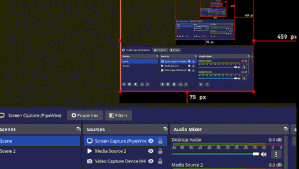

# Procrastination Chess Engine

This is a simple chess engine with UCI support

## Features: 
- FEN generation and parsing
- Mailbox 10x12 board representation
- Alpha-Beta prunning
- Quiessence search
- mvvlva

## Demo, engine playing itself:

